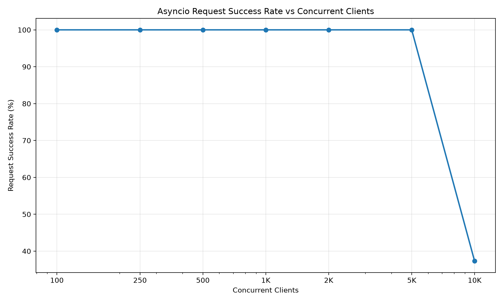
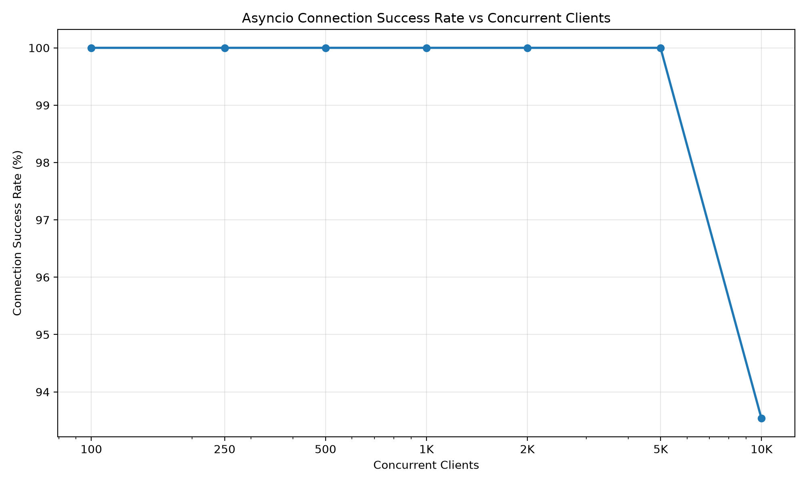
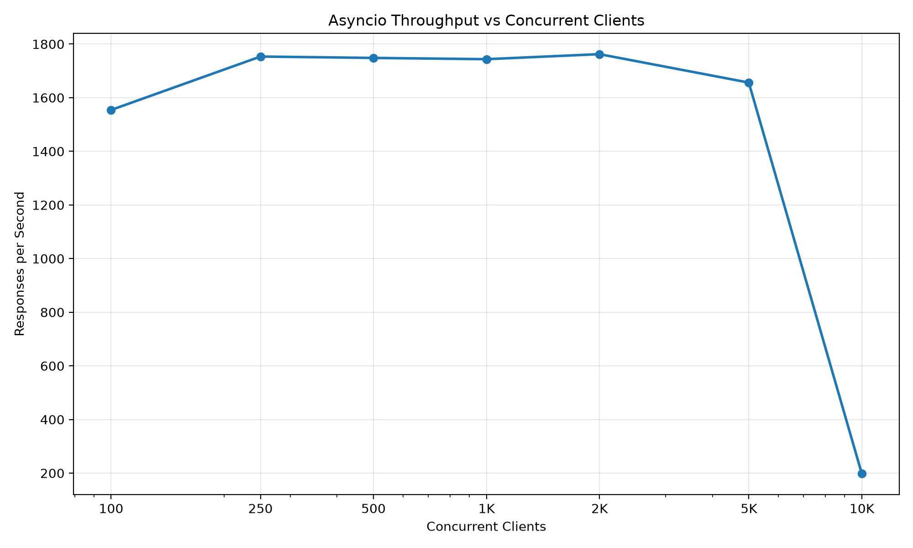
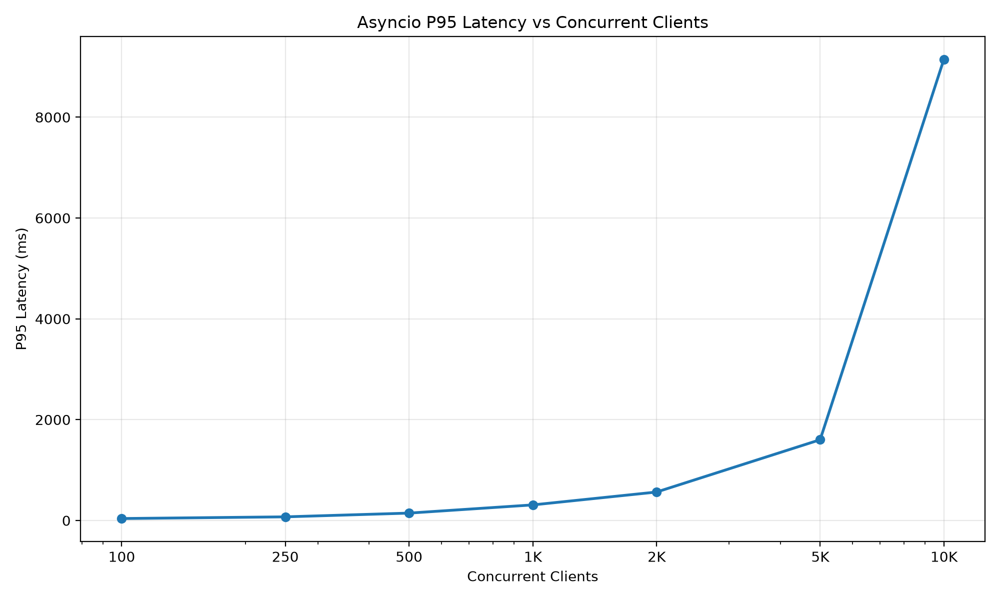

# c10k-python-concurrency
Python C10K concurrency benchmarking project comparing sequential, threaded, thread-pool, selector, and asyncio TCP servers.
# C10K: Python TCP Server Concurrency Benchmark

A Python project exploring how different TCP server architectures behave as the number of clients increases.

I built this project to understand socket programming, concurrency, and performance measurement through practical experiments.

## Server Implementations

The project includes five approaches:

| Approach | Description |
|---|---|
| Sequential | Processes clients one at a time |
| Thread-per-connection | Creates a thread for each client connection |
| Thread pool | Uses a limited pool of worker threads |
| Selector | Uses readiness-based, non-blocking socket I/O |
| Asyncio | Uses asynchronous tasks and an event loop |

## Project Structure

| Folder | Contents |
|---|---|
| `servers/` | TCP server implementations |
| `load_testing/` | Client and load-generation scripts |
| `benchmarking/` | Benchmark runners, resource monitoring, analysis, and graph generation |
| `results/` | Recorded trials, summary CSV files, and graphs |

## Measurements

The benchmark records:

- Connection and request success rates
- Throughput in requests per second
- Median, P95, and P99 latency
- CPU and memory usage
- Thread and handle counts

P95 latency is the response-time threshold at or below which 95% of the measured latency samples fall.

## Recorded Asyncio Results

The following results come from individual trials recorded on 20 September 2026.

| Target clients | Connection success | Request success | Throughput (requests/sec) | P95 latency (ms) | Peak RSS (MiB) |
|---:|---:|---:|---:|---:|---:|
| 250 | 100% | 100% | 1,753 | 72.36 | 37.28 |
| 500 | 100% | 100% | 1,748 | 146.60 | 54.60 |
| 1,000 | 100% | 100% | 1,744 | 309.16 | 88.85 |
| 2,000 | 100% | 100% | 1,762 | 564.46 | 157.75 |
| 5,000 | 100% | 100% | 1,656 | 1,601.85 | 364.38 |
| 10,000 | 93.54% | 37.33% | 198 | 9,148.27 | 642.98 |

At 5,000 target clients, the recorded trial completed 5,000 successful connections and requests.

At 10,000 target clients, 9,354 connections succeeded, but only 3,733 requests succeeded. Latency increased substantially and throughput declined.

These measurements describe the recorded test runs. They are not a guarantee of sustained server capacity.

## Benchmark Graphs

### Asyncio Request Success

### Asyncio Connection Success

### Asyncio Throughput

### Asyncio P95 Latency

## Findings and Limitations

- The five server implementations were compared at 10, 50, and 100 target clients.
- Additional asyncio tests increased the target load to 10,000 clients.
- The supplied high-load dataset contains one recorded trial at each level from 250 to 10,000 clients.
- Successful connections do not necessarily mean successful requests.
- Target client counts alone do not verify that every connection remained open simultaneously.
- The cause of the failures at 10,000 clients has not yet been established.
- Hardware, operating system, Python version, timeout settings, and load-generator behavior can affect the results.
- Full environment details and verified reproduction commands still need to be documented.

## Next Steps

- Document dependencies and exact execution commands.
- Record hardware specifications, Python version, and test configuration.
- Repeat high-load trials to measure variation.
- Capture and classify connection and request errors.
- Investigate server and load-generator resource limits.
- Test sustained workloads and persistent connections.

## What I Learned

- Implementing TCP servers and clients in Python
- Comparing concurrency approaches
- Automating benchmark runs
- Measuring response times and resource usage
- Interpreting performance results and documenting limitations

## Author

**Kanishkar M A**

M.Sc. Integrated Computer Science  
College of Engineering, Guindy, Anna University
